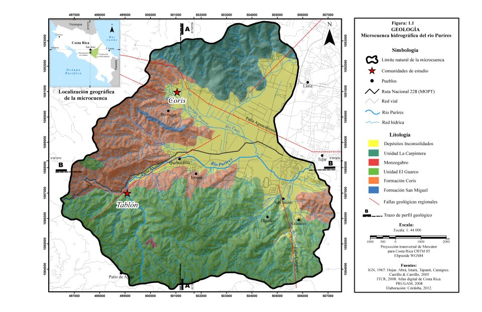

---
authors:
- admin
categories: []
date: "2019-02-05T00:00:00Z"

lastMod: "2019-09-05T00:00:00Z"
projects: []
subtitle: La investigación consiste en el análisis de vulnerabilidad en las comunidades de Coris de Cartago y Tablón de El Guarco ante el impacto de los desastres. Estas comunidades se sitúan dentro de la microcuenca del río Purires en la provincia de Cartago, Costa Rica.
summary: Análisis de vulnerabilidad en las comunidades de Coris de Cartago y Tablón de El Guarco ante el impacto de los desastres.

title: Análisis de vulnerabilidad de las comunidades de Coris y Tablón, Provincia de Cartago, Costa Rica. 
---

## Área de estudio

***La microcuenca del río Purires*** se localiza en el extremo oriental de la re-gión central de Costa Rica. Limita al norte con los cerros de la Carpintera; al oeste y al sur, con las estribaciones de la cordillera de Talamanca y al este, con las ciuda-des de Cartago y Tejar de El Guarco (Figura 1). La microcuenca cubre un área de 76, 2 km² y se emplaza en la sección alta de un sistema hidrográfico de mayores dimensiones (2 950 km²): la cuenca del río Reventazón–Parismina que desembo-ca en el Mar Caribe. Esta cuenca es una de las más importantes de Costa Rica, pues allí se genera el 25% de la energía hidroeléctrica del país, abastece de agua potable al 50% de la población del Área Metropolitana de San José y se produce el 11% del valor total de las exportaciones locales (Sogreah Ingenierie et al., 2000).

Asimismo, a pesar de que la zona general de estudio fue la microcuenca del río Purires, se consideraron también las comunidades de Coris de Cartago y Tablón de El Guarco, en las cuales se elaboró el análisis de vulnerabilidad; por tanto, es necesario establecer su ubicación geográfica como ejes de referencia espacial.El pueblo de Coris de Cartago (Figura 1) se localiza sobre los 1 400 m de al-titud y se ubica al noroeste de la microcuenca, aproximadamente a 3 km del pueblo de Quebradilla. Administrativamente pertenece al distrito de Quebradilla del cantón central de Cartago en la provincia de Cartago.

Por su parte, el pueblo de Tablón de El Guarco se sitúa sobre los 1 600 m de altitud y se ubica en el extremo suroeste de la microcuenca, aproximadamente a 2, 5 km de distancia del pueblo de Tobosi. En términos político - administrativos pertenece al distrito de Tobosi del cantón de El Guarco, provincia de Cartago.Dado  su  contexto  geográfico  y  social,  ecológico  y  climático,  así  como geológico  y  geomorfológico,  la  microcuenca  del  río  Purires  está  expuesta  a  un escenario  de  múltiples  amenazas  compuestas  por  la  combinación  de  eventos naturales como sismos, actividad volcánica y eventos hidrometeorológicos; ame-nazas socionaturales les como deslizamientos, erosión y desbordamientos de la red hídrica y amenazas antrópicas como derrames de sustancias peligrosas y con-taminación del agua, aire y suelo, generada por la actividad industrial, comercial, agropecuaria  y  residencial  ubicada  tanto  dentro  como  fuera  de  la  microcuenca.En términos morfométricos la microcuenca del río Purires presenta un fac-tor de forma de 0, 76 (forma casi circular) y un patrón de drenaje con forma dendrí-tica de densidad regular (Zúñiga, 1993) que cubre un área de 76, 2 km², por lo cual se puede clasificar como una microcuenca pequeña.El clima del área de estudio es particular, ya que es afectado por la influen-cia directa e indirecta de eventos hidrometeorológicos tanto, en el Mar Caribe como en el Oceáno Pacífico. Según Solano y Villalobos (2001), este clima se clasifica como Valle Central 2 (VC2), ya que registra precipitaciones moderadas cercanas a los 2 000 mm por año (con 128 días de lluvia y sólo un mes seco durante el año), así como temperaturas frescas con máximas promedio de 26 ºC y mínimas promedio de 15 ºC.

Dado  su  contexto  geográfico  y  social,  ecológico  y  climático,  así  como geológico  y  geomorfológico,  la  microcuenca  del  río  Purires  está  expuesta  a  un escenario  de  múltiples  amenazas  compuestas  por  la  combinación  de  eventos naturales como sismos, actividad volcánica y eventos hidrometeorológicos; ame-nazas socionaturales les como deslizamientos, erosión y desbordamientos de la red hídrica y amenazas antrópicas como derrames de sustancias peligrosas y con-taminación del agua, aire y suelo, generada por la actividad industrial, comercial, agropecuaria  y  residencial  ubicada  tanto  dentro  como  fuera  de  la  microcuenca.En términos morfométricos la microcuenca del río Purires presenta un fac-tor de forma de 0, 76 (forma casi circular) y un patrón de drenaje con forma dendrí-tica de densidad regular (Zúñiga, 1993) que cubre un área de 76, 2 km², por lo cual se puede clasificar como una microcuenca pequeña.El clima del área de estudio es particular, ya que es afectado por la influen-cia directa e indirecta de eventos hidrometeorológicos tanto, en el Mar Caribe como en el Oceáno Pacífico. Según Solano y Villalobos (2001), este clima se clasifica como Valle Central 2 (VC2), ya que registra precipitaciones moderadas cercanas a los 2 000 mm por año (con 128 días de lluvia y sólo un mes seco durante el año), así como temperaturas frescas con máximas promedio de 26 ºC y mínimas promedio de 15 ºC.En cuanto a la geología, Carrillo & Carrillo (2005), indican que la microcuen-ca está formada por litologías de origen sedimentario (Formación Coris y San Mi-guel) y volcánico (Grupo Aguacate) muy meteorizadas, con espesores que oscilan entre los 15 m y 500 m (Berrangué & Whittaker, 1977; Denyer & Arias, 1991) y que fueron depositadas alternadamente desde la época del Terciario. Estas litologías se ubican en los sectores norte, oeste y sur de la microcuenca

El relieve de la zona de estudio está compuesto en su mayoría (56% del total del área de estudio) por pendientes planas y medias entre los 0º y los 30º de inclinación. Sin embargo, el restante 44% está conformado por un relieve inestable de pendientes fuertes y muy fuertes (mayores a los 30º de inclinación), localizadas geográficamente al sur de la microcuenca (Figura 2). Dicho relieve, se compone de litologías volcánicas del período Terciario, muy meteorizadas y  propensas a des-lizarse cuando se combinan con eventos detonantes y disparadores como lluvias intensas y eventos sísmicos de magnitudes considerables (Carrillo & Carrillo, 2005).La situación anterior, evidencia una amenaza potencial para las personas, los cultivos y la infraestructura ubicada, particularmente, en los sectores que pre-sentan una topografía con pendientes fuertes, pues los temblores, en áreas sis-micamente activas (similar al área de estudio), ponen en movimiento las laderas inestables en forma de deslizamientos (Peraldo & Acevedo, 2010).El tipo de suelo predominante (un 92% del total del área de la microcuenca) es inceptisol (suelo incipiente) con texturas limosas, arenosas y arcillosas (Carrillo & Carrillo, 2005), producto de la meteorización de rocas sedimentarias y volcánicas de los períodos Terciario y Cuaternario.Finalmente, el paisaje del área está tapizado por un mosaico de coberturas vegetales y un uso de la tierra variado pero con una marcada tendencia a la activi-dad agropecuaria. Según el PRUGAM (2010), los usos de la tierra predominantes en la zona de estudio son: bosques secundarios (41,27%), pastos y áreas defores-tadas (25,19%), así como uso mixto (16,43%) e invernaderos para la producción de hortalizas y plantas ornamentales (6,70%).

## Metodología

Para Kholer et al. (2004), existen varios enfoques para elaborar un análisis de vulnerabilidad; por esa razón, no se han establecido procedimientos estanda-rizados, y no hay un consenso definido en cuanto a los indicadores pertinentes por utilizar. Dado lo anterior, la selección de una determinada metodología para el análisis de vulnerabilidad, estará íntimamente relacionada con la escala de análisis y las características de los elementos bajo estudio (Melone, 2003).El proceso metodológico utilizado en la investigación posee cuatro etapas de bajo costo económico, abiertas, dinámicas y enmarcadas dentro del paradigma de la Investigación Cualitativa de Acción Participativa desde el enfoque de la educa-ción no formal2 las cuales se detallan de forma resumida a continuación:La Etapa I consistió en la evaluación de las condiciones y las variables so-cioambientales más relevantes de la microcuenca del río Purires tales como: rasgos socioeconómicos y demográficos de la población que habita en las comunidades de estudio; rasgos morfométricos de la microcuenca, clima y uso de la tierra, así como el tipo de suelo; geomorfología y geología presente en el área de estudio.

La Etapa II se basó en el trabajo de campo, mediante recorridos y giras planificadas a las comunidades de Coris y Tablón, así como al resto del área de la microcuenca del río Purires, con el objetivo de recolectar información no documen-tada en fuentes bibliográficas y cartográficas existentes.En la Etapa III se aplicó el instrumento metodológico diseñado por Toro (2002) denominado: Metodología para el análisis de riesgo y vulnerabilidad en sis-temas de agua potable y saneamiento, cuyo propósito final es obtener resultados en valores porcentuales (resultados cuantitativos) a partir de información cualitativa (Céspedes, 2011).Según la FICR (2006), el análisis de vulnerabilidad consiste en recopilar, analizar y sistematizar, de una forma estructurada y lógica, información sobre la vulnerabilidad de una comunidad a una determinada amenaza. La información re-copilada, sirve entonces, para diagnosticar los riesgos principales y las capacidades actuales de la comunidad y lleva, en último término, a la preparación de actividades dirigidas a reducir la vulnerabilidad de la población ante posibles desastres y así, incrementar su capacidad de supervivencia y recuperación.Para lograr lo anterior, fue necesario el desarrollo de talleres de trabajo, donde la participación de los hombres y mujeres, tanto adultos como jóvenes, que forman parte de las comunidades e integran organizaciones de diverso índole en ambos pueblos, fue clave y de suma importancia. La aplicación de la herramienta metodológica seleccionada proporcionó criterios de intervención, mediante la cons-trucción de escenarios de riesgo que facilitaron elegir, identificar y valorar (cuali-tativamente y cuantitativamente) las amenazas, el riesgo y la vulnerabilidad que presentaron no sólo los sistemas de abastecimiento y saneamiento de agua, sino toda la infraestructura comunal (escuelas y viviendas, puentes, templos y salones comunales, colegios, caminos y líneas de transmisión eléctrica), cuya inclusión en el análisis fue considerada como importante por los participantes de los talleres de trabajo.Por último, la etapa IV comprendió la organización, síntesis y presentación final de los resultados obtenidos en las etapas I, II y III, a partir de lo cual se defi236 Facultad de Ciencias EspacialesREVISTA CIENCIAS ESPACIALES,  VOLUMEN 8,  NÚMERO 1  PRIMAVERA, 2015nieron estrategias y recomendaciones desde la perspectiva de la gestión del riesgo para la prevención de los desastres, en busca de mejorar la calidad de vida de las personas que habitan en las comunidades de estudio.

## Resultados

El tema y las acciones relacionadas con los desastres y la gestión del ries-go, es un campo que cuenta con larga trayectoria de investigación, bibliografía, enfoques teóricos y experiencias en la gestión (Fernández, 1996). Por tal razón, en este apartado se define brevemente el concepto asociado a la vulnerabilidad, dado a que éste, es utilizado en reiteradas ocasiones a lo largo del presente documento.La vulnerabilidad de las sociedades ante el impacto de los desastres, se produce por la interacción de un conjunto de factores como la falta de planificación y la ausencia de políticas a largo plazo para el ordenamiento del territorio, la debi-lidad institucional y la intensificación del uso de la tierra, así como la explotación descontrolada de los recursos naturales, el incremento acelerado de la población y la presencia de condiciones socioeconómicas desfavorables, sobre todo, en comu-nidades empobrecidas (Buch & Turcios, 2003).

Además, la Ley Nacional de Emergencias y Prevención del Riesgo de Cos-ta Rica (La Gaceta Nº 8, 11 de enero de 2006: Ley N°8488) plantea que la vulnera-bilidad es una condición intrínseca de ser impactado por un suceso a causa de un conjunto de condiciones y procesos físicos, sociales, económicos y ambientales. Se determina por el grado de exposición y fragilidad de los elementos susceptibles de ser afectados, la población, sus haberes, las actividades de bienes y servicios, el ambiente y la limitación de su capacidad para recuperarse.Una vez definido el concepto de vulnerabilidad, se procederá a presentar los resultados obtenidos del análisis de vulnerabilidad realizado en las comunidades de Coris y Tablón, el cual inició con el inventario comunal de recursos para saber qué recursos e infraestructuras existían en cada comunidad.El objetivo del inventario fue estimular la discusión sobre el estado, la ca-lidad, la antigüedad, el tipo de materiales y la ubicación geográfica de los recursos para identificar las amenazas o peligros en un futuro cercano (Toro, 2002; Córdoba, 2012). Los inventarios se elaboraron y plasmaron en catálogos y mapas de percep-ción, que fueron realizados por los participantes de los talleres de trabajo.Las comunidades de Coris de Cartago (Figura 3) y Tablón de El Guarco (Figura 4) disponen de recursos infraestructurales (viviendas, caminos, iglesias, es-cuelas y salones comunales), así como de organizaciones comunales (mujeres, de-sarrollo integral, deportes, educativas y ASADAs) los cuales generaron condiciones para facilitar el diálogo con sus respectivos representantes y líderes, en términos de dirigir esfuerzos y recursos hacia la identificación de factores de riesgo a nivel local.Lo anterior permitió definir acciones para disminuir el riesgo desde la cons-trucción local con perspectiva en el mediano y largo plazo, y que así los actores sociales puedan participar activamente en la gestión adecuada de sus recursos co-munales, humanos y ambientales (Brenes & González, 1996); ya que según Santos (1986), la casa, el lugar, el trabajo, los puntos de encuentro, los caminos que unen entre sí estos puntos, son elementos pasivos (con significancia) que condicionan la actividad del serhumano y comandan su práctica social.En Coris de Cartago, la infraestructura gestionada y construida por la propia comunidad representa el 70% del total del inventario realizado a través de los talle-res de trabajo. Estos están compuestos por el centro educativo y el salón de catequesis, el templo católico y el salón comunal, la plaza de deportes, los vestidores y el acueducto. Además el inventario también incluyó la infraestructura vial (caminos principales, vecinales y puentes), bajo la administración de la Municipalidad de Car-tago y los órganos adscritos al MOPT como el CONAVI o el COLOSEVI3.Dicha infraestructura beneficia tanto a los pobladores de Coris como a per-sonas de otras comunidades (Tablón, Quebradilla, Bermejo y Tobosi), pues facilitan la comunicación y el desplazamiento diario de las personas a los centros de salud, educación, comercio, zonas de cultivo y lugares de trabajo, situados tanto dentro como fuera de los límites de la microcuenca. Estos recursos representan el 30% del total del inventario de la infraestructura de la comunidad.Por su parte, el inventario de recursos en el pueblo de Tablón de El Guarco demostró que la infraestructura comunal gestionada y construida por la propia co-munidad representa el 60%. Esta está compuesta por el templo católico, el salón de catequesis, la escuela y el salón comunal, el campo de fútbol, la oficina de la ASADA y los tanques de almacenamiento de agua.

